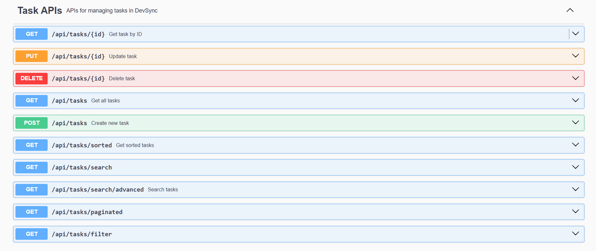

# DevSync 🚀

DevSync is a backend application that helps developers track coding problems from multiple platforms in one place.
## Tech Stack
- Java 
- Spring Boot
- Spring Data JPA
- PostgreSQL
- Maven
- SLF4J Logging
- Swagger (OpenAPI)

## Features
- Create, Update, Delete tasks
- Pagination support
- Search tasks
- Advanced filtering
- Sorting API
- DTO architecture
- Global exception handling
- Validation
- API documentation using Swagger


## API Documentation

Swagger UI available at:
http://localhost:8080/swagger-ui/index.html

URL:
http://localhost:5173/

## Architecture

Controller → Service → Repository → Database


## API Endpoints

POST /api/tasks  
GET /api/tasks  
GET /api/tasks/{id}  
PUT /api/tasks/{id}  
DELETE /api/tasks/{id}

Pagination:
GET /api/tasks/paginated?page=0&size=5

### Create Task

POST /api/tasks

Request Body :
``
{
"title":"Dynamic Programming",
"platform":"LeetCode"
}
``

## Project Structure

### Front End Structure
```

```

### Back End Structur
```
src/main/java/com/brajesh/devsync
│
├── controller
│       TaskController
│
├── service
│       TaskService
│
├── repository
│       TaskRepository
│
├── entity
│       Task
│
├── dto
│       TaskRequestDto
│       TaskResponseDto
│
├── exception
│       GlobalExceptionHandler
│       ErrorResponse
```

## Future Improvements
- React Frontend
- Authentication (JWT)
- Multi platform integrations

## API Preview
